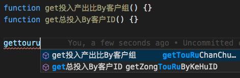

# 中文代码快速补全

【1.1.1 更新】试添加中文 snippets：2 个 Python 片段，1 个 JavaScript。如有相关建议如使用问题、希望添加的片段，欢迎[提 issue](https://github.com/program-in-chinese/vscode_Chinese_Input_Assistant/issues)。支持中、英、拼音三种触发方式，下面是拼音演示（其他方式与瑕疵详见[此 PR](https://github.com/program-in-chinese/vscode_Chinese_Input_Assistant/pull/24)）：

## 功能简介

英文输入下，匹配中文标识符。多谢 @lsby 实现了不限于当前文件内标识符的补全，如下面导入库的方法补全：

支持多种中文输入方式如下。

***注：全拼之外，双拼和五笔为 beta。多谢 @YoungBoron 添加五笔四码功能！***

五笔四码演示：

支持各种编程语言，全拼下已实测过的：

- C#

- Haskell

- Java

- JavaScript

- Kotlin

- PHP

对 $ 开头的变量名，直接输入拼音即有提示：

- Python

- Swift

- TypeScript

同样支持中英混合命名：

## [版本更新说明](CHANGELOG.md)

## 已知问题

暂无
